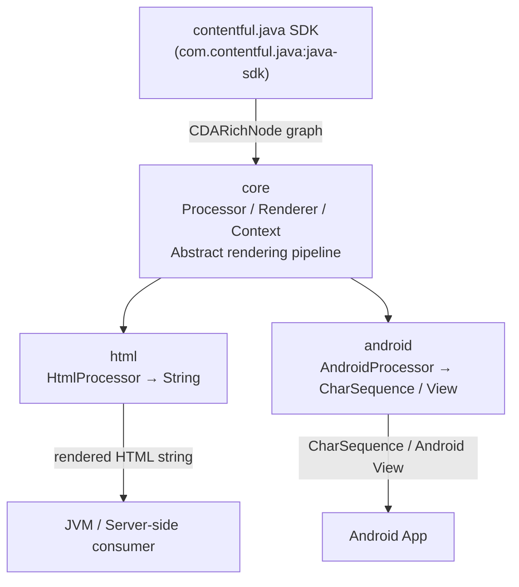

# Architecture

<!-- Generated by seed-golden-context | Last updated: 2026-05-11 -->

## Overview

`rich-text-renderer-java` is a publish-and-forget Java library that converts Contentful Rich Text nodes (modeled in the [contentful.java SDK](https://github.com/contentful/contentful.java)) into rendered output. It ships three submodules — `core`, `html`, and `android` — each distributed independently via JitPack. Consumers plug in custom `Renderer` implementations for embedded entries and hyperlinks that the library cannot generically resolve.

## System Context



## Internal Structure

| Module | Package | Purpose |
|---|---|---|
| `core` | `com.contentful.rich.core` | Abstract `Processor<C, R>`, `Renderer<C, R>`, `RenderabilityChecker<C>`, and `Context<T>` — the rendering pipeline backbone |
| `core/simple` | `com.contentful.rich.core.simple` | `Simplifier` utility that strips empty or over-nested nodes from the CDARichNode graph before rendering |
| `html` | `com.contentful.rich.html` | `HtmlProcessor` (extends `Processor<HtmlContext, String>`) with default renderers for all standard Rich Text node types; output is an HTML string |
| `android` | `com.contentful.rich.android` | `AndroidProcessor<T>` with two factory methods: `creatingCharSequences()` (Spannable output) and `creatingNativeViews()` (Android View tree output) |
| `android_sample` | — | Standalone sample Android app demonstrating the android renderer; not published |

## Data Flow

1. Consumer fetches a `CDARichDocument` (or constructs one via `RichTextFactory.resolveRichNode(jsonMap)`) using the Contentful Java SDK.
2. An optional `Simplifier` pass removes empty nodes or enforces nesting limits (e.g., `RemoveToDeepNesting`) on the graph.
3. Consumer instantiates a `Processor` (e.g., `HtmlProcessor`, `AndroidProcessor.creatingCharSequences()`).
4. Consumer calls `processor.process(context, node)`.
5. The `Processor` walks the node tree. For each node it iterates its ordered `List<CheckingRenderer>`. For each pair it calls `checker.canRender(context, node)`; if that returns `true` it calls `renderer.render(context, node)`. Iteration stops only when a renderer returns a **non-null** result — a renderer returning `null` is treated as "no match" and the loop continues to the next `CheckingRenderer`.
6. The `Context` accumulates the traversal path (`onBlockEntered` / `onBlockExited`) so renderers can be context-aware.
7. Rendered output (String for HTML; CharSequence or View for Android) is returned to the consumer.

```mermaid
sequenceDiagram
    participant C as Consumer
    participant P as Processor
    participant CR as CheckingRenderer (ordered list)
    participant R as Renderer

    C->>P: process(context, rootNode)
    loop for each node
        loop for each CheckingRenderer pair
            P->>CR: checker.canRender(context, node)?
            CR-->>P: true
            P->>R: renderer.render(context, node)
            R-->>P: result (non-null = stop; null = continue to next pair)
        end
    end
    P-->>C: final result
```

## Key Dependencies

| Dependency | Why it's here |
|---|---|
| `com.contentful.java:java-sdk:10.5.18` | Provides the `CDARichNode` / `CDARichBlock` / `CDARichDocument` type hierarchy that this library renders (see [ADR-0001](./docs/ADRs/0001-jitpack-distribution.md)) |
| `com.google.code.findbugs:jsr305:3.0.2` | Provides `@Nonnull` / `@Nullable` annotations used throughout the API surface |
| `org.apache.commons:commons-text:1.10.0` | HTML entity escaping in the `html` module |
| `androidx.appcompat:appcompat:1.7.0-alpha03` | Android UI base classes in the `android` module |
| `androidx.cardview:cardview:1.0.0` | Card-based view rendering for embedded entries in Android |
| `org.robolectric:robolectric:4.14.1` | Android unit test execution on the JVM (test-only) |
| `com.google.truth:truth:1.1.5` | Fluent test assertions (test-only) |
| `junit:junit:4.13.2` | Test runner (test-only) |

## Configuration

This is a library — there is no runtime configuration surface. All customization is done at construction time by adding or overriding `Renderer` / `RenderabilityChecker` pairs on the `Processor`.

| Build property | Purpose | Default |
|---|---|---|
| `contentful_version` (root `build.gradle`) | Pinned version of `contentful.java` SDK used across all modules | `10.5.18` |
| `org.gradle.parallel` | Parallel Gradle execution | `true` |
| `org.gradle.caching` | Gradle build cache | `true` |
| `android.compileSdk` | Android compile SDK level | `35` |
| `android.minSdkVersion` | Minimum Android API level supported | `21` |

## Integration Points

### Upstream (this repo consumes)

- **contentful.java SDK** (`com.contentful.java:java-sdk`) — provides the complete `CDARichNode` type system. This library renders nodes but does not fetch content; consumers must fetch via the SDK or parse JSON themselves using `RichTextFactory`.

### Downstream (consumes this repo)

- Any **JVM application** that needs to render Contentful Rich Text fields to HTML strings.
- Any **Android application** that needs to render Contentful Rich Text fields to `CharSequence` (Spannable) or native Android `View` trees.
- Distributed via [JitPack](https://jitpack.io/#contentful/rich-text-renderer-java) — see [ADR-0001](./docs/ADRs/0001-jitpack-distribution.md).

## Extension Model

The library is designed for extension, not configuration. Three patterns:

1. **Add a renderer** — `processor.addRenderer(checker, renderer)` appends to the list; called only if no prior renderer matched.
2. **Override a renderer** — `processor.overrideRenderer(checker, renderer)` prepends to the list; checked first, short-circuits defaults.
3. **Custom Simplifier** — instantiate `Simplifier(Simplification...)` with custom `Simplification` passes before calling `process`.

Embedded entries and inline/block hyperlinks **require** custom renderers — the library ships no defaults for these because it cannot know the consumer's content model.
